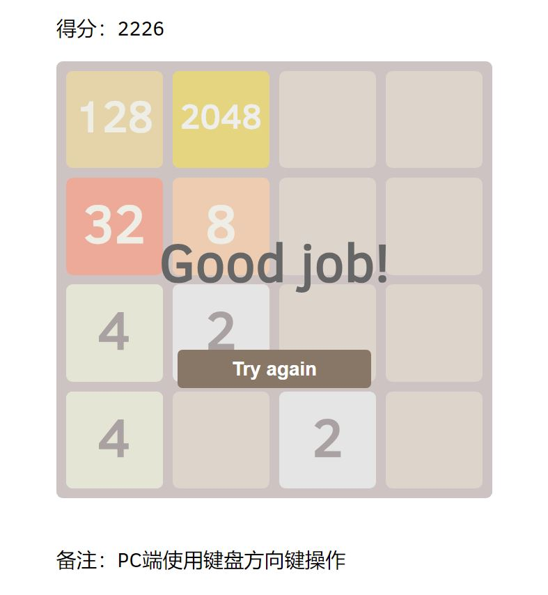

# vue2048
The Game 2048 developed by vue.
The origin project is [vue-2048](https://github.com/pengfu/vue-2048).  
I used Vue-cli 3.0 to rewrite this project and used vue-touch to add swipe action.

To be honest,there's still a bug that cells become invisible when the board is full.In a formal way,you can pass the game.XD

### Demo
https://kasonsx.github.io/vue2048/

### First Blood


## Project setup
```
npm install
```

### Compiles and hot-reloads for development
```
npm run serve
```

### Compiles and minifies for production
```
npm run build
```

### Lints and fixes files
```
npm run lint
```
